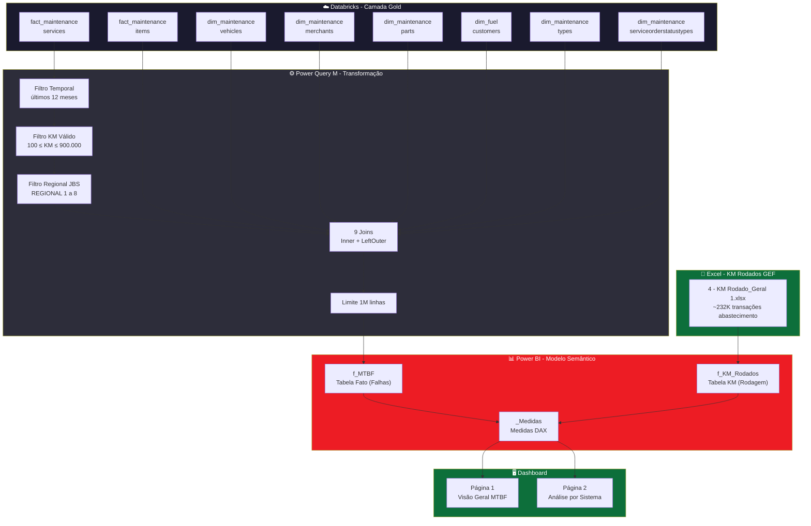
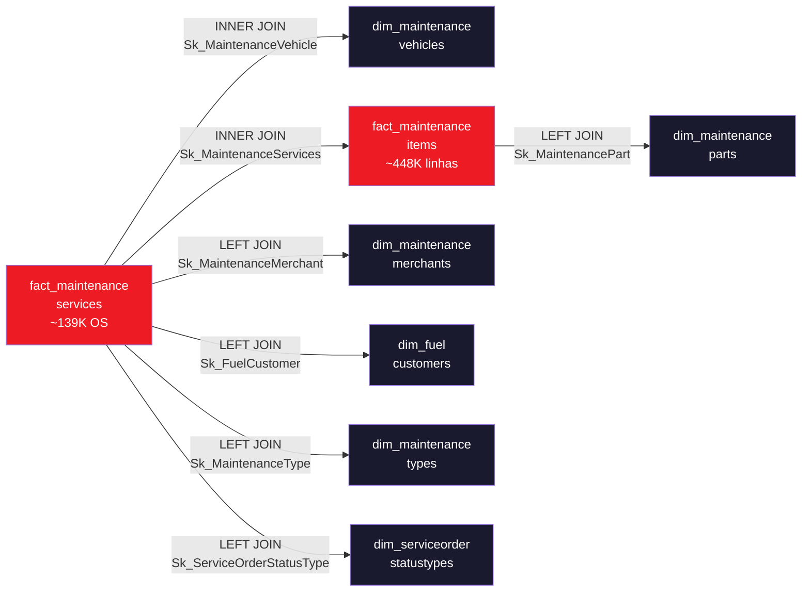
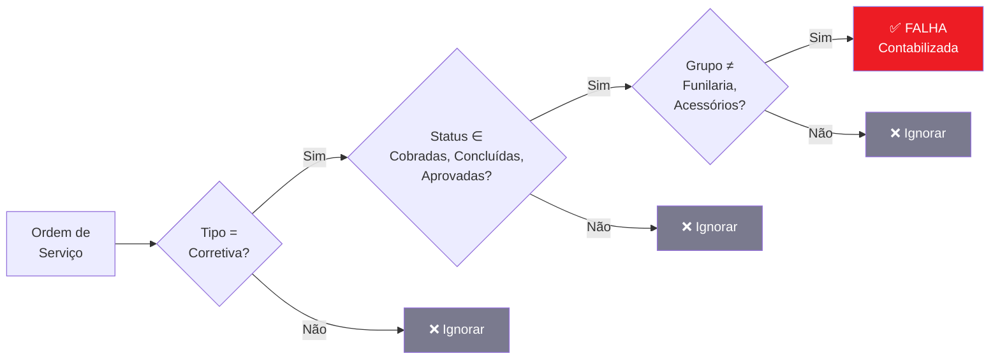

# 📊 Painel MTBF — Foco JBS

> **MTBF (Mean Time Between Failures)** — Dashboard de análise de confiabilidade da frota de veículos para as regionais JBS, construído com Power BI + Databricks.

---

## 🏗️ Arquitetura do Projeto



---

## 📋 Modelo de Dados — Tabelas

### Tabelas Fato (Origem Databricks)

| Tabela                     | Schema                | Descrição                       | Chaves                        |
| -------------------------- | --------------------- | ------------------------------- | ----------------------------- |
| `fact_maintenanceservices` | `hive_metastore.gold` | Ordens de serviço de manutenção | `Sk_MaintenanceServices` (PK) |
| `fact_maintenanceitems`    | `hive_metastore.gold` | Itens/peças de cada OS          | `Sk_MaintenanceServices` (FK) |

<<<<<<< HEAD
=======
# <<<<<<< Updated upstream

>>>>>>> docs/documentation
### Tabela KM Rodados (Origem Excel — provisório)

| Tabela         | Origem                       | Descrição                                | Volume       |
| -------------- | ---------------------------- | ---------------------------------------- | ------------ |
| `f_KM_Rodados` | `4 - KM Rodado_Geral 1.xlsx` | Transações de abastecimento (GEF) com KM | ~232K linhas |

<<<<<<< HEAD
> **Nota**: A tabela correta no Databricks é `fact_transactionfuel` (colunas `KilometersDriven`, `Mileage`, `PreviousMileage`), mas o pipeline ETL não carrega transações JBS nesta tabela. O Excel é usado provisoriamente até correção do pipeline.
=======
> **⚠️ Fonte provisória**: A tabela `f_KM_Rodados` é carregada de um **arquivo Excel local** (não do Databricks). A tabela equivalente no Databricks seria `fact_transactionfuel` (colunas `KilometersDriven`, `Mileage`, `PreviousMileage`), porém o pipeline ETL atual não carrega transações JBS nesta tabela. O Excel é mantido provisoriamente até que a equipe de engenharia de dados corrija o pipeline.
>
> **Impacto**: Como `f_KM_Rodados` **não possui coluna de Regional**, o filtro de regional é propagado indiretamente via `TREATAS(VALUES(f_MTBF[Placa]), f_KM_Rodados[Placa])` — ou seja, a medida `Distância Total KM` filtra KM pelas placas que pertencem à regional selecionada.
>>>>>>> docs/documentation

#### Colunas `f_KM_Rodados`

| Coluna            | Tipo    | Descrição                       |
| ----------------- | ------- | ------------------------------- |
| `Placa`           | Texto   | Placa do veículo                |
| `KM Rodados`      | Inteiro | KM rodados entre abastecimentos |
| `Familia Veiculo` | Texto   | Família do veículo              |
| `Mes`             | Inteiro | Mês da transação                |
| `Ano`             | Inteiro | Ano da transação                |
| `Data`            | Data    | Data da transação               |
| `Nome Reduzido`   | Texto   | Nome reduzido do cliente        |

### Tabelas Dimensão (Origem Databricks)

| Tabela                                   | Schema                | Descrição                                     | Chave SK                    |
| ---------------------------------------- | --------------------- | --------------------------------------------- | --------------------------- |
| `dim_maintenancevehicles`                | `hive_metastore.gold` | Veículos — placa, operação, regional, família | `Sk_MaintenanceVehicle`     |
| `dim_maintenancemerchants`               | `hive_metastore.gold` | Oficinas/fornecedores — UF, estado            | `Sk_MaintenanceMerchant`    |
| `dim_maintenanceparts`                   | `hive_metastore.gold` | Peças — nome, grupo de peças                  | `Sk_MaintenancePart`        |
| `dim_fuelcustomers`                      | `hive_metastore.gold` | Clientes — código, nome                       | `Sk_FuelCustomer`           |
| `dim_maintenancetypes`                   | `hive_metastore.gold` | Tipos de manutenção (Corretiva/Preventiva)    | `Sk_MaintenanceType`        |
| `dim_maintenanceserviceorderstatustypes` | `hive_metastore.gold` | Status da OS (Cobradas, Aprovadas, etc.)      | `Sk_ServiceOrderStatusType` |

### Tabela f_MTBF (Resultado no Power BI)

| Coluna               | Tipo             | Origem (sourceColumn)                                    |
| -------------------- | ---------------- | -------------------------------------------------------- |
| `OS`                 | Inteiro          | `MaintenanceId`                                          |
| `Placa`              | Texto            | `LicensePlate`                                           |
| `Peca`               | Texto            | `PartName`                                               |
| `Grupo_Pecas`        | Texto            | `PartGroupName`                                          |
| `Data_Inicio`        | Data             | `ServiceStartTimestamp`                                  |
| `Data_Encerramento`  | Data             | `ServiceCompletionTimestamp`                             |
| `KM`                 | Inteiro          | `MileageNumber` (odômetro OS — usado apenas para falhas) |
| `UF`                 | Texto            | `StateName`                                              |
| `Operações`          | Texto            | `AdditionalInformation1Description`                      |
| `Familia`            | Texto            | `VehicleFamilyName`                                      |
| `Fabricante_Veiculo` | Texto            | `VehicleManufacturer`                                    |
| `Tipo_Manutencao`    | Texto            | `MaintenanceType`                                        |
| `Status_Servico`     | Texto            | `StatusTypeDescription`                                  |
| `VA_Aprovado_Peca`   | Decimal          | `PriceApproved`                                          |
| `MesRef`             | Data (calculada) | `DATE(YEAR(Data_Inicio), MONTH(Data_Inicio), 1)`         |

---

## 🔗 Fluxo de Joins (Power Query M)



### Ordem dos Joins (Otimização)

| Passo | Join                                     | Tipo      | Chave                               | Propósito                                    |
| ----- | ---------------------------------------- | --------- | ----------------------------------- | -------------------------------------------- |
| 1     | `fact_maintenanceservices`               | Base      | —                                   | Ponto de partida (~4M → filtrado para ~139K) |
| 2     | `dim_maintenancevehicles`                | **INNER** | `Sk_MaintenanceVehicle`             | Placa, Operação, Regional, Família           |
| 3     | Filtro Regional JBS                      | —         | `AdditionalInformation3Description` | REGIONAL 1 a 8                               |
| 4     | `fact_maintenanceitems`                  | **INNER** | `Sk_MaintenanceServices`            | Peças, Valor aprovado (~448K)                |
| 5     | `dim_maintenancemerchants`               | LEFT      | `Sk_MaintenanceMerchant`            | UF da oficina                                |
| 6     | `dim_maintenanceparts`                   | LEFT      | `Sk_MaintenancePart`                | Nome e Grupo da peça                         |
| 7     | `dim_fuelcustomers`                      | LEFT      | `Sk_FuelCustomer`                   | Código e nome do cliente                     |
| 8     | `dim_maintenancetypes`                   | LEFT      | `Sk_MaintenanceType`                | Tipo de manutenção                           |
| 9     | `dim_maintenanceserviceorderstatustypes` | LEFT      | `Sk_ServiceOrderStatusType`         | Status da OS                                 |

---

## 📐 Lógicas de Cálculo (Medidas DAX)

```mermaid
flowchart TD
    subgraph FONTES["📦 Fontes de Dados"]
        FKML["f_KM_Rodados\nExcel GEF\n~232K transações"]
        FMTBF["f_MTBF\nDatabricks\nOS de manutenção"]
    end

    subgraph FILTROS["🔒 Filtros de Negócio"]
        FC["Tipo_Manutencao = 'Corretiva'"]
        FS2["Status ∈ Cobradas, Concluídas,\nAprovadas, Aprov. Parcialmente"]
        FG["Grupo_Pecas ∉ Funilaria, Acessórios"]
    end

    subgraph MEDIDAS["📊 Medidas"]
<<<<<<< HEAD
        DIST["Distância Total KM\nSUM(f_KM_Rodados[KM Rodados])"]
=======
<<<<<<< Updated upstream
        DIST["Distância Total KM\nSUMX por Placa\nMax(KM) - Min(KM)"]
=======
        DIST["Distância Total KM\nSUM f_KM_Rodados via TREATAS"]
>>>>>>> Stashed changes
>>>>>>> docs/documentation
        FALHAS["Qtd Falhas\nCOUNTROWS distintos\nPlaca + Data_Inicio"]
        MTBF["MTBF KM\nDIVIDE Distância Falhas"]
        VEIC["Total Veículos\nDISTINCTCOUNT Placa"]
    end

<<<<<<< HEAD
    FKML --> DIST
    FMTBF --> FALHAS
=======
<<<<<<< Updated upstream
=======
    FKML --> DIST
    FMTBF -->|"TREATAS Placa"| DIST
    FMTBF --> FALHAS
>>>>>>> Stashed changes
>>>>>>> docs/documentation
    FC --> FALHAS
    FS2 --> FALHAS
    FG --> FALHAS
    DIST --> MTBF
    FALHAS --> MTBF

    style FONTES fill:#0D6F3B,color:#FFF
    style FILTROS fill:#2D2D3A,color:#FFF
    style MEDIDAS fill:#ED1C24,color:#FFF
```

### Detalhamento das Medidas

<<<<<<< HEAD
| Medida                 | Fórmula                                                          | Fonte          | Descrição                                  |
| ---------------------- | ---------------------------------------------------------------- | -------------- | ------------------------------------------ |
| **Distância Total KM** | `CALCULATE(SUM(f_KM_Rodados[KM Rodados]), USERELATIONSHIP(...))` | `f_KM_Rodados` | Soma de KM rodados entre abastecimentos    |
| **Qtd Falhas**         | `COUNTROWS(SUMMARIZE(FILTER(...), Placa, Data_Inicio))`          | `f_MTBF`       | Eventos distintos de parada (Placa + Data) |
| **MTBF (KM)**          | `DIVIDE(Distância Total, Qtd Falhas)`                            | Ambas          | Quilometragem média entre falhas           |
| **Total Quebras**      | `[Qtd Falhas]`                                                   | `f_MTBF`       | Alias para visualizações de quebras        |
| **Rodagem Mensal KM**  | `[Distância Total KM]`                                           | `f_KM_Rodados` | Alias para gráficos de rodagem             |
| **Total Veículos**     | `DISTINCTCOUNT(Placa)`                                           | `f_MTBF`       | Contagem de placas distintas               |

> **Correção 2026-02-22**: A medida `Distância Total KM` foi alterada de `SUMX(VALUES(Placa), MAX(KM) - MIN(KM))` (odômetro de manutenção, impreciso) para `SUM(f_KM_Rodados[KM Rodados])` (KM reais de abastecimento GEF). Validado contra Excel de referência: ~12-14M KM/mês, 2.124 placas.
=======
<<<<<<< Updated upstream
| Medida | Fórmula | Formato | Descrição |
| ---------------------- | ------------------------------------------------------- | ---------- | ----------------------------------------------- |
| **Distância Total KM** | `SUMX(VALUES(Placa), MAX(KM) - MIN(KM))` | `#,##0 KM` | Variação de odômetro por placa, filtro outliers |
| **Qtd Falhas** | `COUNTROWS(SUMMARIZE(FILTER(...), Placa, Data_Inicio))` | `#,##0` | Eventos distintos de parada (Placa + Data) |
| **MTBF (KM)** | `DIVIDE(Distância Total, Qtd Falhas)` | `#,##0 KM` | Quilometragem média entre falhas |
| **Total Quebras** | `[Qtd Falhas]` | `#,##0` | Alias para visualizações de quebras |
| **Rodagem Mensal KM** | `[Distância Total KM]` | `#,##0 KM` | Alias para gráficos de rodagem |
| **Total Veículos** | `DISTINCTCOUNT(Placa)` | `#,##0` | Contagem de placas distintas no contexto |
=======
| Medida | Fórmula | Fonte | Descrição |
| ---------------------- | ----------------------------------------------------------------------------- | -------------- | ------------------------------------------- |
| **Distância Total KM** | `CALCULATE(SUM(f_KM_Rodados[KM Rodados]), TREATAS(VALUES(f_MTBF[Placa])...))` | `f_KM_Rodados` | KM rodados, filtrado por contexto via Placa |
| **Qtd Falhas** | `COUNTROWS(SUMMARIZE(FILTER(...), Placa, Data_Inicio))` | `f_MTBF` | Eventos distintos de parada (Placa + Data) |
| **MTBF (KM)** | `DIVIDE(Distância Total, Qtd Falhas)` | Ambas | Quilometragem média entre falhas |
| **Total Quebras** | `[Qtd Falhas]` | `f_MTBF` | Alias para visualizações de quebras |
| **Rodagem Mensal KM** | `[Distância Total KM]` | `f_KM_Rodados` | Alias para gráficos de rodagem |
| **Total Veículos** | `DISTINCTCOUNT(Placa)` | `f_MTBF` | Contagem de placas distintas |

> **Correção 2026-02-22**: A medida `Distância Total KM` foi alterada de `SUMX(VALUES(Placa), MAX(KM) - MIN(KM))` (odômetro de manutenção, impreciso) para `SUM(f_KM_Rodados[KM Rodados])` (KM reais de abastecimento GEF). Validado contra Excel de referência: ~12-14M KM/mês, 2.124 placas.
>
> > > > > > > Stashed changes

> **Correção 2026-02-23**: Duas correções aplicadas:
>
> 1. A medida `Distância Total KM` agora **sempre** usa `TREATAS(VALUES(f_MTBF[Placa]), f_KM_Rodados[Placa])` para propagar filtros indiretos (Regional, Operação, etc.) de `f_MTBF` para `f_KM_Rodados`. Antes, o KM total da frota inteira era usado como numerador quando o chart quebrava por Regional, inflacionando o MTBF.
> 2. O filtro temporal de `f_MTBF` foi alterado de `Date.AddYears(DateTime.LocalNow(), -1)` para `Date.StartOfMonth(Date.AddMonths(DateTime.LocalNow(), -11))`, garantindo que apenas **meses completos** apareçam no gráfico (sem spike no primeiro mês parcial).
>>>>>>> docs/documentation

---

## 📏 Regras de Negócio

### Definição de Falha



### Regras Aplicadas

| #   | Regra                  | Descrição                                                                |
| --- | ---------------------- | ------------------------------------------------------------------------ |
| 1   | **Somente Corretiva**  | Manutenções preventivas não contam como falha                            |
| 2   | **Status válidos**     | Cobradas, Concluídas e Não Cobradas, Aprovadas, Aprovadas Parcialmente   |
| 3   | **Exclusão de grupos** | Funilaria e Acessórios são excluídos do cálculo de falhas                |
| 4   | **Contagem distinta**  | Uma falha = 1 evento (Placa + Data), independente da quantidade de peças |
| 5   | **Filtro KM**          | Outliers de odômetro removidos: KM < 100 ou KM > 900.000                 |
| 6   | **Período**            | Últimos 11 meses completos + mês atual (arredondado ao 1º dia do mês)    |
| 7   | **Regionais JBS**      | Somente REGIONAL 1 a REGIONAL 8                                          |
| 8   | **Limite de dados**    | Máximo 1.000.000 de linhas importadas                                    |

### Fórmula MTBF

> **MTBF (KM) = Distância Total Percorrida ÷ Número de Falhas**
>
> Quanto **maior** o MTBF, **mais confiável** é a frota.

---

## 🖥️ Páginas do Dashboard

### Página 1 — Visão Geral MTBF

- **4 KPI Cards**: Total Veículos, Total Quebras, Rodagem Total, MTBF Global
- **Line Chart**: MTBF mensal por Regional
- **Bar Chart**: MTBF por Placa (Top/Bottom)
- **Slicers**: Período, Regional, Tipo Operação

### Página 2 — Análise por Grupo de Peças (JBS-PT2)

- **Line Chart**: MTBF mensal por Tipo de Operação (Top 5: Boiadeiro, Container Friboi, Frigorífica, Container Seara, Couro Verde)
- **Stacked Bar Chart**: Composição mensal de quebras por Sistema/Grupo de Peças
- **Slicers**: Regional, Operações, Grupo de Peças, Período

---

## 🛠️ Stack Tecnológica

| Componente          | Tecnologia                             |
| ------------------- | -------------------------------------- |
| **Dados**           | Azure Databricks (hive_metastore.gold) |
| **ETL**             | Power Query M (joins e filtros)        |
| **Modelagem**       | Power BI Semantic Model (TMDL)         |
| **Cálculos**        | DAX (medidas)                          |
| **Relatório**       | Power BI Report (PBIR)                 |
| **Versionamento**   | Git + GitHub                           |
| **Formato projeto** | Power BI Project (PBIP)                |

---

## 📁 Estrutura do Repositório

```
MTBF-PLACA-CARLOS.Report/          ← Relatório Power BI
├── definition/
│   ├── pages/
│   │   ├── fd9f95bb.../           ← Página 1 (Visão Geral)
│   │   └── a1b2c3d4.../          ← Página 2 (Análise JBS-PT2)
│   └── report.json
├── 4 - KM Rodado_Geral 1.xlsx    ← Excel de KM Rodados (fonte provisória)
└── MTBF-PLACA-CARLOS(FOCO-JBS).pbix

MTBF-PLACA-CARLOS.SemanticModel/   ← Modelo Semântico
├── definition/
│   ├── tables/
│   │   ├── f_MTBF.tmdl            ← Tabela fato OS (Databricks)
│   │   ├── f_KM_Rodados.tmdl      ← Tabela KM rodados (Excel GEF)
│   │   ├── _Medidas.tmdl          ← Medidas DAX
│   │   └── d_Calendario.tmdl      ← Calendário
│   └── relationships.tmdl         ← Relacionamentos
└── .platform
```

---

<div align="center">

---

**Criado por Luiz Eduardo — Time de Dados · Entrega de Resultados**

_Edenred Brasil · 2026_

---

</div>
