# 📊 Painel MTBF — Foco JBS

> **MTBF (Mean Time Between Failures)** — Dashboard de análise de confiabilidade da frota de veículos para as regionais JBS, construído com Power BI + Databricks.

---

## 🏗️ Arquitetura do Projeto

```mermaid
flowchart TB
    subgraph DATABRICKS["☁️ Databricks - Camada Gold"]
        FS["fact_maintenance\nservices"]
        FI["fact_maintenance\nitems"]
        DV["dim_maintenance\nvehicles"]
        DM["dim_maintenance\nmerchants"]
        DP["dim_maintenance\nparts"]
        DC["dim_fuel\ncustomers"]
        DT["dim_maintenance\ntypes"]
        DS["dim_maintenance\nserviceorderstatustypes"]
    end

    subgraph ETL["⚙️ Power Query M - Transformação"]
        F1["Filtro Temporal\núltimos 12 meses"]
        F2["Filtro KM Válido\n100 ≤ KM ≤ 900.000"]
        F3["Filtro Regional JBS\nREGIONAL 1 a 8"]
        JN["9 Joins\nInner + LeftOuter"]
        LM["Limite 1M linhas"]
    end

    subgraph PBI["📊 Power BI - Modelo Semântico"]
        FATO["f_MTBF\nTabela Fato"]
        MED["_Medidas\nMedidas DAX"]
    end

    subgraph DASH["🖥️ Dashboard"]
        P1["Página 1\nVisão Geral MTBF"]
        P2["Página 2\nAnálise por Sistema"]
    end

    FS --> F1 --> F2 --> F3
    F3 --> JN
    FI --> JN
    DV --> JN
    DM --> JN
    DP --> JN
    DC --> JN
    DT --> JN
    DS --> JN
    JN --> LM --> FATO
    FATO --> MED
    MED --> P1
    MED --> P2

    style DATABRICKS fill:#1A1A2E,color:#FFF
    style ETL fill:#2D2D3A,color:#FFF
    style PBI fill:#ED1C24,color:#FFF
    style DASH fill:#0D6F3B,color:#FFF
```



---

## 📋 Modelo de Dados — Tabelas

### Tabelas Fato (Origem Databricks)

| Tabela                     | Schema                | Descrição                       | Chaves                        |
| -------------------------- | --------------------- | ------------------------------- | ----------------------------- |
| `fact_maintenanceservices` | `hive_metastore.gold` | Ordens de serviço de manutenção | `Sk_MaintenanceServices` (PK) |
| `fact_maintenanceitems`    | `hive_metastore.gold` | Itens/peças de cada OS          | `Sk_MaintenanceServices` (FK) |

### Tabelas Dimensão (Origem Databricks)

| Tabela                                   | Schema                | Descrição                                     | Chave SK                    |
| ---------------------------------------- | --------------------- | --------------------------------------------- | --------------------------- |
| `dim_maintenancevehicles`                | `hive_metastore.gold` | Veículos — placa, operação, regional, família | `Sk_MaintenanceVehicle`     |
| `dim_maintenancemerchants`               | `hive_metastore.gold` | Oficinas/fornecedores — UF, estado            | `Sk_MaintenanceMerchant`    |
| `dim_maintenanceparts`                   | `hive_metastore.gold` | Peças — nome, grupo de peças                  | `Sk_MaintenancePart`        |
| `dim_fuelcustomers`                      | `hive_metastore.gold` | Clientes — código, nome                       | `Sk_FuelCustomer`           |
| `dim_maintenancetypes`                   | `hive_metastore.gold` | Tipos de manutenção (Corretiva/Preventiva)    | `Sk_MaintenanceType`        |
| `dim_maintenanceserviceorderstatustypes` | `hive_metastore.gold` | Status da OS (Cobradas, Aprovadas, etc.)      | `Sk_ServiceOrderStatusType` |

### Tabela Resultado no Power BI

| Coluna               | Tipo             | Origem (sourceColumn)                            |
| -------------------- | ---------------- | ------------------------------------------------ |
| `OS`                 | Inteiro          | `MaintenanceId`                                  |
| `Placa`              | Texto            | `LicensePlate`                                   |
| `Peca`               | Texto            | `PartName`                                       |
| `Grupo_Pecas`        | Texto            | `PartGroupName`                                  |
| `Data_Inicio`        | Data             | `ServiceStartTimestamp`                          |
| `Data_Encerramento`  | Data             | `ServiceCompletionTimestamp`                     |
| `KM`                 | Inteiro          | `MileageNumber`                                  |
| `UF`                 | Texto            | `StateName`                                      |
| `Operações`          | Texto            | `AdditionalInformation1Description`              |
| `Familia`            | Texto            | `VehicleFamilyName`                              |
| `Fabricante_Veiculo` | Texto            | `VehicleManufacturer`                            |
| `Tipo_Manutencao`    | Texto            | `MaintenanceType`                                |
| `Status_Servico`     | Texto            | `StatusTypeDescription`                          |
| `VA_Aprovado_Peca`   | Decimal          | `PriceApproved`                                  |
| `MesRef`             | Data (calculada) | `DATE(YEAR(Data_Inicio), MONTH(Data_Inicio), 1)` |

---

## 🔗 Fluxo de Joins (Power Query M)


### Ordem dos Joins (Otimização)

| Passo | Join                                     | Tipo      | Chave                               | Propósito                                    |
| ----- | ---------------------------------------- | --------- | ----------------------------------- | -------------------------------------------- |
| 1     | `fact_maintenanceservices`               | Base      | —                                   | Ponto de partida (~4M → filtrado para ~139K) |
| 2     | `dim_maintenancevehicles`                | **INNER** | `Sk_MaintenanceVehicle`             | Placa, Operação, Regional, Família           |
| 3     | Filtro Regional JBS                      | —         | `AdditionalInformation3Description` | REGIONAL 1 a 8                               |
| 4     | `fact_maintenanceitems`                  | **INNER** | `Sk_MaintenanceServices`            | Peças, Valor aprovado (~448K)                |
| 5     | `dim_maintenancemerchants`               | LEFT      | `Sk_MaintenanceMerchant`            | UF da oficina                                |
| 6     | `dim_maintenanceparts`                   | LEFT      | `Sk_MaintenancePart`                | Nome e Grupo da peça                         |
| 7     | `dim_fuelcustomers`                      | LEFT      | `Sk_FuelCustomer`                   | Código e nome do cliente                     |
| 8     | `dim_maintenancetypes`                   | LEFT      | `Sk_MaintenanceType`                | Tipo de manutenção                           |
| 9     | `dim_maintenanceserviceorderstatustypes` | LEFT      | `Sk_ServiceOrderStatusType`         | Status da OS                                 |

---

## 📐 Lógicas de Cálculo (Medidas DAX)

```mermaid
flowchart TD
    subgraph FILTROS["🔒 Filtros de Negócio"]
        FC["Tipo_Manutencao = 'Corretiva'"]
        FS2["Status ∈ Cobradas, Concluídas,\nAprovadas, Aprov. Parcialmente"]
        FG["Grupo_Pecas ∉ Funilaria, Acessórios"]
        FK["100 ≤ KM ≤ 900.000"]
    end

    subgraph MEDIDAS["📊 Medidas"]
        DIST["Distância Total KM\nSUMX por Placa\nMax(KM) - Min(KM)"]
        FALHAS["Qtd Falhas\nCOUNTROWS distintos\nPlaca + Data_Inicio"]
        MTBF["MTBF (KM)\nDIVIDE(Distância, Falhas)"]
        VEIC["Total Veículos\nDISTINCTCOUNT(Placa)"]
    end

    FC --> FALHAS
    FS2 --> FALHAS
    FG --> FALHAS
    FK --> DIST
    DIST --> MTBF
    FALHAS --> MTBF

    style FILTROS fill:#2D2D3A,color:#FFF
    style MEDIDAS fill:#ED1C24,color:#FFF
```



### Detalhamento das Medidas

| Medida                 | Fórmula                                                 | Formato    | Descrição                                       |
| ---------------------- | ------------------------------------------------------- | ---------- | ----------------------------------------------- |
| **Distância Total KM** | `SUMX(VALUES(Placa), MAX(KM) - MIN(KM))`                | `#,##0 KM` | Variação de odômetro por placa, filtro outliers |
| **Qtd Falhas**         | `COUNTROWS(SUMMARIZE(FILTER(...), Placa, Data_Inicio))` | `#,##0`    | Eventos distintos de parada (Placa + Data)      |
| **MTBF (KM)**          | `DIVIDE(Distância Total, Qtd Falhas)`                   | `#,##0 KM` | Quilometragem média entre falhas                |
| **Total Quebras**      | `[Qtd Falhas]`                                          | `#,##0`    | Alias para visualizações de quebras             |
| **Rodagem Mensal KM**  | `[Distância Total KM]`                                  | `#,##0 KM` | Alias para gráficos de rodagem                  |
| **Total Veículos**     | `DISTINCTCOUNT(Placa)`                                  | `#,##0`    | Contagem de placas distintas no contexto        |

---

## 📏 Regras de Negócio

### Definição de Falha

```mermaid
flowchart LR
    OS["Ordem de\nServiço"] --> C1{"Tipo =\nCorretiva?"}
    C1 -->|Sim| C2{"Status ∈\nCobradas, Concluídas,\nAprovadas?"}
    C1 -->|Não| X1["❌ Ignorar"]
    C2 -->|Sim| C3{"Grupo ≠\nFunilaria,\nAcessórios?"}
    C2 -->|Não| X2["❌ Ignorar"]
    C3 -->|Sim| OK["✅ FALHA\nContabilizada"]
    C3 -->|Não| X3["❌ Ignorar"]

    style OK fill:#ED1C24,color:#FFF
    style X1 fill:#7A7A8E,color:#FFF
    style X2 fill:#7A7A8E,color:#FFF
    style X3 fill:#7A7A8E,color:#FFF
```



### Regras Aplicadas

| #   | Regra                  | Descrição                                                                |
| --- | ---------------------- | ------------------------------------------------------------------------ |
| 1   | **Somente Corretiva**  | Manutenções preventivas não contam como falha                            |
| 2   | **Status válidos**     | Cobradas, Concluídas e Não Cobradas, Aprovadas, Aprovadas Parcialmente   |
| 3   | **Exclusão de grupos** | Funilaria e Acessórios são excluídos do cálculo de falhas                |
| 4   | **Contagem distinta**  | Uma falha = 1 evento (Placa + Data), independente da quantidade de peças |
| 5   | **Filtro KM**          | Outliers de odômetro removidos: KM < 100 ou KM > 900.000                 |
| 6   | **Período**            | Últimos 12 meses a partir da data atual                                  |
| 7   | **Regionais JBS**      | Somente REGIONAL 1 a REGIONAL 8                                          |
| 8   | **Limite de dados**    | Máximo 1.000.000 de linhas importadas                                    |

### Fórmula MTBF

> **MTBF (KM) = Distância Total Percorrida ÷ Número de Falhas**
>
> Quanto **maior** o MTBF, **mais confiável** é a frota.

---

## 🖥️ Páginas do Dashboard

### Página 1 — Visão Geral MTBF

- **4 KPI Cards**: Total Veículos, Total Quebras, Rodagem Total, MTBF Global
- **Line Chart**: MTBF mensal por Regional
- **Bar Chart**: MTBF por Placa (Top/Bottom)
- **Slicers**: Período, Regional, Tipo Operação

### Página 2 — Análise por Grupo de Peças (JBS-PT2)

- **Line Chart**: MTBF mensal por Tipo de Operação (Top 5: Boiadeiro, Container Friboi, Frigorífica, Container Seara, Couro Verde)
- **Stacked Bar Chart**: Composição mensal de quebras por Sistema/Grupo de Peças
- **Slicers**: Regional, Operações, Grupo de Peças, Período

---

## 🛠️ Stack Tecnológica

| Componente          | Tecnologia                             |
| ------------------- | -------------------------------------- |
| **Dados**           | Azure Databricks (hive_metastore.gold) |
| **ETL**             | Power Query M (joins e filtros)        |
| **Modelagem**       | Power BI Semantic Model (TMDL)         |
| **Cálculos**        | DAX (medidas)                          |
| **Relatório**       | Power BI Report (PBIR)                 |
| **Versionamento**   | Git + GitHub                           |
| **Formato projeto** | Power BI Project (PBIP)                |

---

## 📁 Estrutura do Repositório

```
MTBF-PLACA-CARLOS.Report/          ← Relatório Power BI
├── definition/
│   ├── pages/
│   │   ├── fd9f95bb.../           ← Página 1 (Visão Geral)
│   │   └── a1b2c3d4.../          ← Página 2 (Análise JBS-PT2)
│   └── report.json
└── MTBF-PLACA-CARLOS(FOCO-JBS).pbix

MTBF-PLACA-CARLOS.SemanticModel/   ← Modelo Semântico
├── definition/
│   └── tables/
│       ├── f_MTBF.tmdl            ← Tabela fato + Power Query
│       └── _Medidas.tmdl          ← Medidas DAX
└── .platform
```

---

<div align="center">

---

**Criado por Luiz Eduardo — Time de Dados · Entrega de Resultados**

_Edenred Brasil · 2026_

---

</div>
